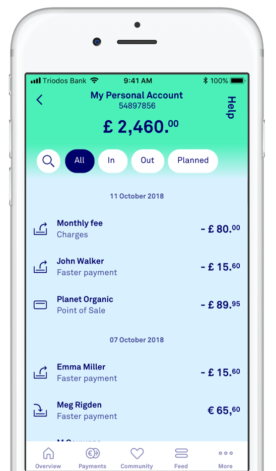
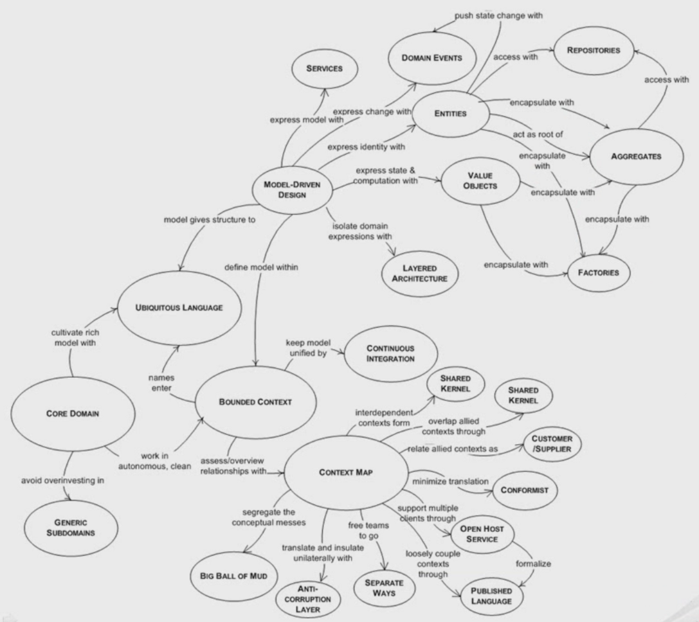

---
author:
  - Bèr `berkes` Kessels
title: Event Sourcing
subtitle: "Event Sourcing basics - Nimma.codes 25-10-2022"
abstract: "Event sourcing is een software-architectuur waarbij software haar interne toestand niet direct bijhoudt in een database, maar door het lezen en vastleggen van gebeurtenissen in een event store. Zoals de balans op je bankrekening niet een cijfertje in een database is, maar een afgeleide van een hele serie transacties op die bankrekening. We lopen door wat voorbeelden heen, leren wanneer event-sourcing een goede match is, en welke architectuur-patronen er vaak omheen worden ingezet"
keywords: es, eventsourcing, ddd
lang: nl
---

# Event Sourcing {background-image="./dvd_screensaver.gif"}

## Over deze presentatie

* Is online: [berk.es/es](https://berk.es/es) (github.com/berkes/es)
* Bevat alle links
* Is in het Nederlands

## Over mij {background-image="./ber.jpg"}

* Bèr `berkes` Kessels
* @berkes - LinkedIn, Twitter, Fediverse
* CTO at [REDACTED]
* Blog berk.es

## Doel

* Wegwijs worden in de chaos van TLAs.
* Een volgend project met ES opzetten?

## Event Sourcing is simpel.

---



---

Aggregate, Left Fold, Reduce, Projection, etc.

---

We slaan alle transacties op - events. Balans krijgen we door ze te doorlopen.

---

* Wat was onze balans op vrijdag de 13e om 13:37?
* Hoeveel dagen hebben we rood gestaan?
* Teken een diagram van ons loon over de jaren heen.

---


---

* Wat zouden we een klant die een balpen koopt nog meer aanraden?
* Bij welke prijzen gaan klanten producten uit de winkelwagen halen?

---

* Audit Log
* Toekomstige analyse
* Data representeert de werkelijkheid

---


---

* Git
* Bank - Boekhouden
* Blockchain
* AWS

---

> Het algemene doel van een logboek is dat later teruggelezen kan worden wat er precies gebeurd is op een bepaald moment. Op het moment van opschrijven is dus nog niet bekend wat men later terug wil lezen. Het is dus van groot belang dat alle details in het logboek terechtkomen, zodat men later niets mist.

---

> Ook is het van belang dat de vastleggingen in een logboek authentiek zijn. De gegevens mogen niet verwijderd of ongecontroleerd gemuteerd worden. 

[Wikipedia Logboek](https://nl.wikipedia.org/wiki/Logboek)

---


---

```ruby
##
# A position is the amount of a security, asset, or property that is owned (or
# sold short) by some individual or other entity.
class Position
  attr_reader :total_buying_price

  def initialize(ticker:, currency:)
    @events = []
    @ticker = ticker
    @currency = currency
    @total_buying_price = 0
  end

  def add_transaction(amount:, price:)
    handle_event(PositionAdded.new(amount: amount, price: price))
  end

  private

  attr_reader :events

  ##
  # Handles an incoming event.
  # For now, we keep it simple: no DSLs or fancy metaprogramming, just a switch.
  def handle_event(event)
    @events << event
    case event
    when PositionAdded
      handle_position_added(event)
    end
  end

  ##
  # Our handle_event calls this method for each PositionAdded event
  def handle_position_added(event)
    @total_buying_price += event.amount * event.price
  end
end

class PositionAdded < OpenStruct
end
```

---

```ruby
aapl = Position.new(ticker: 'AAPL', currency: 'USD')
aapl.add_transaction(amount: 2, price: 131.13)
aapl.add_transaction(amount: 3, price: 172.42)
puts aapl.total_buying_price
```

## The world of ES



## Pro's and cons

## ES everything

## Resources

* Domain-Driven Design: Tackling Complexity in the Heart of Software - Eric Evans
* Implementing Domain-Driven Design - Vaugh Vernon
* https://martinfowler.com/eaaDev/EventSourcing.html - Martin Fowler
* https://www.youtube.com/watch?v=LDW0QWie21s - DDD, CQRS and Event Sourcing - Greg Young
